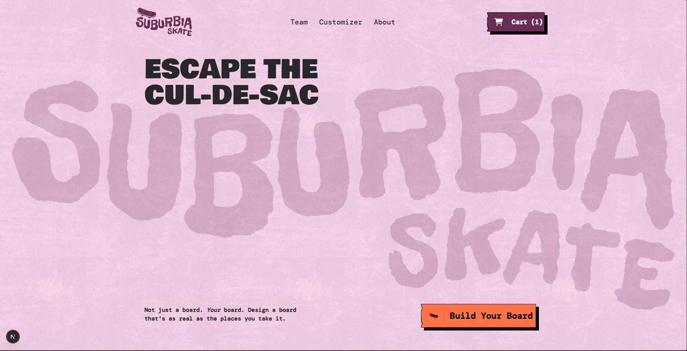

# Suburbia Skateboards

A 3D skateboard customizer and landing page for a fictional skateboard brand, built with Next.js, Prismic, GSAP, and Three.js. I'm building it by following a course, to learn how a headless CMS fits together with an animated, interactive frontend.

> **Status: in progress.** See the [Roadmap](#roadmap) for what works today and what's next.



## About

Suburbia Skateboards is a fictional brand. The site is a landing page plus an interactive customizer where visitors will be able to build their own skateboard in real time, choosing the deck, wheels, trucks, and other parts, and see the result in 3D.

The project is also a way to practice:

- Modeling and managing content in Prismic (page types and slices)
- Rendering that content in the Next.js App Router
- Building 3D interactions in React with react-three-fiber
- Adding scroll and UI animations with GSAP

## Tech stack

- [Next.js 15](https://nextjs.org) (App Router, `src/` directory)
- [Prismic](https://prismic.io) as the headless CMS
- [Three.js](https://threejs.org) with [react-three-fiber](https://r3f.docs.pmnd.rs) for the 3D customizer
- [GSAP](https://gsap.com) for animation
- [Tailwind CSS](https://tailwindcss.com) for styling
- TypeScript
- [`clsx`](https://github.com/lukeed/clsx) and [`react-icons`](https://react-icons.github.io/react-icons/)
- [pnpm](https://pnpm.io) as the package manager

## Roadmap

- [x] Project setup with Next.js and Prismic
- [x] Homepage page type and `HeroSection` slice
- [x] Animated hero background using SVG filters
- [ ] Additional landing page slices
- [ ] GSAP animations
- [ ] 3D skateboard customizer (react-three-fiber)
- [ ] Deployment

## Getting started

### Prerequisites

- Node.js (a current LTS version)
- pnpm
- A Prismic repository (a free account works)

### Installation

```bash
git clone https://github.com/<your-username>/<your-github-repo>.git
cd <your-repo>
pnpm install
```

### Connect to Prismic

Prismic stores the content, so this project needs a Prismic repository to run against. Initialize the project with the Prismic CLI:

```bash
pnpm dlx prismic init --repo <your-prismic-repository-name>
```

`prismic init` configures the project for Prismic: it writes `prismic.config.json` (which holds the repository name and routes), installs the Prismic packages, and creates the Prismic client file (`prismicio.ts`). The CLI may ask you to log in to Prismic first.

This generates the local model files and the TypeScript types for your slices and page types.

Prismic stores the content in a Prismic repository (separate from this GitHub repository)

If you cloned this repository, `prismic.config.json` already exists and points at my repository. Running `init` without `--repo` stops with a message in that case, so pass the domain of your own repository to connect to yours instead.

### Run the development server

```bash
pnpm dev
```

Open [http://localhost:3000](http://localhost:3000) in your browser.

### Build for production

```bash
pnpm build
pnpm start
```

## Project structure

```
├── customtypes/       Prismic page type models
├── public/            Static assets
└── src/
    ├── app/           Next.js routes and layouts
    ├── components/    Shared UI components
    └── slices/        Prismic slices (model + component)
```

Adjust this to match your actual layout.

## Acknowledgements

This project follows the course [Learn Next.js 15, GSAP, Three.js and Prismic to build a 3D skateboard website! - Full Course 2025](https://www.youtube.com/watch?v=LBOhVng5rk8) by Alex Trost on the Prismic YouTube channel, also available on [Prismic's course page](https://prismic.io/courses/suburbia-skateboards).

- Course source code: [prismicio-community/suburbia](https://github.com/prismicio-community/suburbia)
- Course demo site: [suburbia-skate.netlify.app](https://suburbia-skate.netlify.app/)

The Suburbia Skateboards concept, the design, and the overall architecture come from the course. I'm building my own copy to learn Prismic and its surrounding tools.

### Changes from the course

- Uses the current Prismic CLI and Type Builder workflow (`prismic pull` / `prismic push`) instead of Slice Machine, which the course repository is set up with
- Uses pnpm (the course repository uses npm)

Anything else I change will be added to this list.
